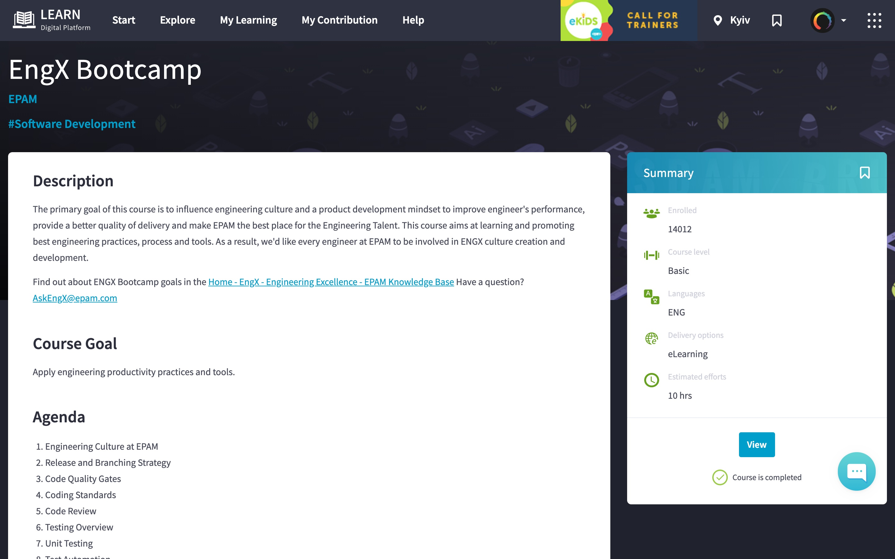
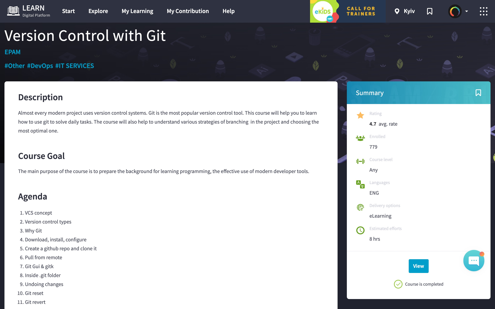
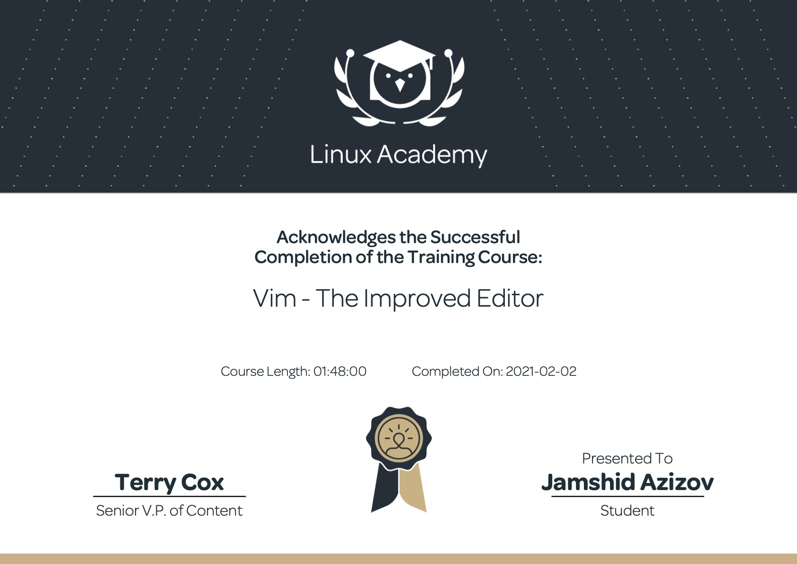
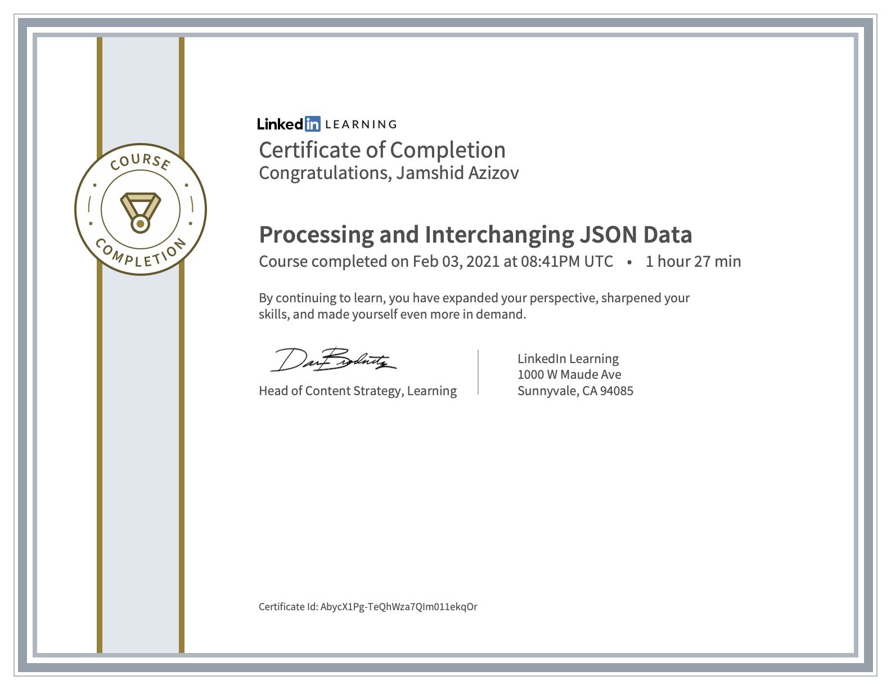
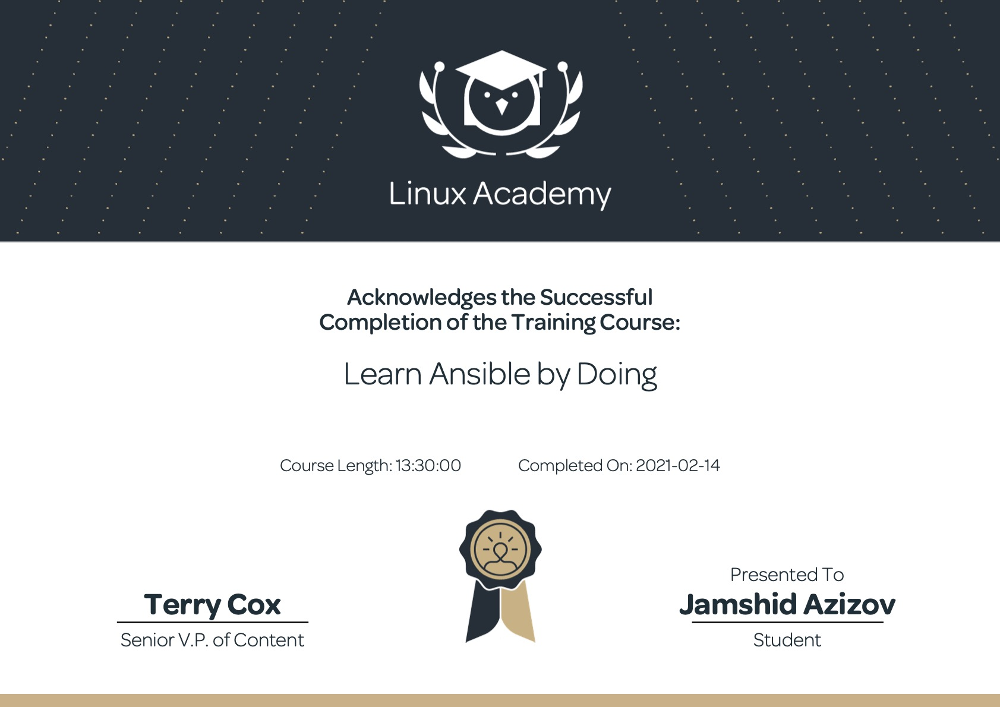
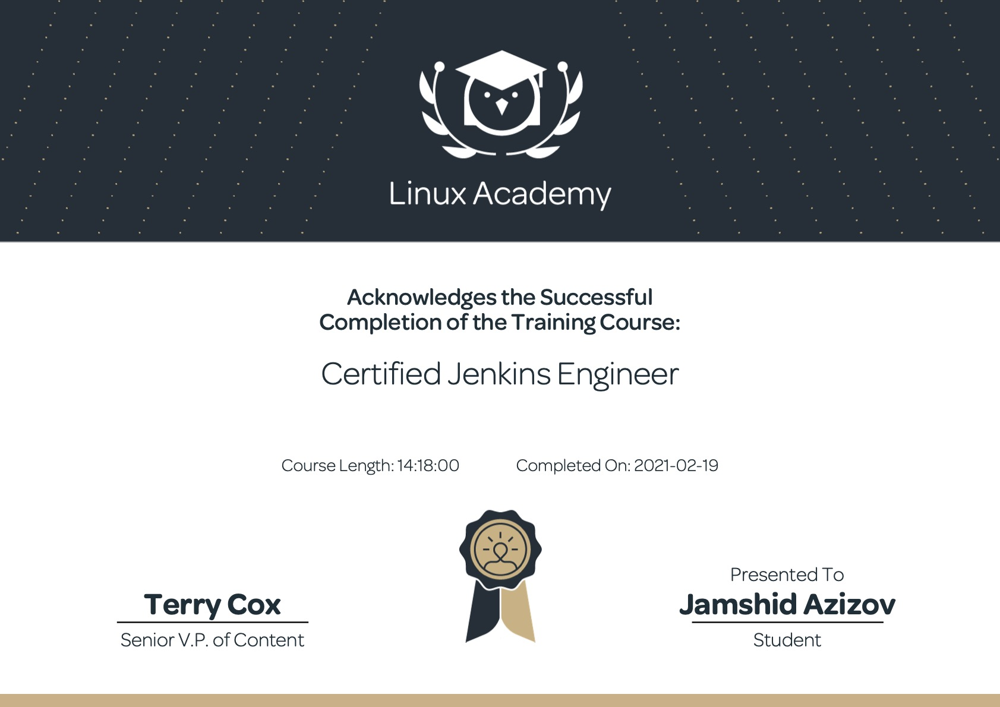
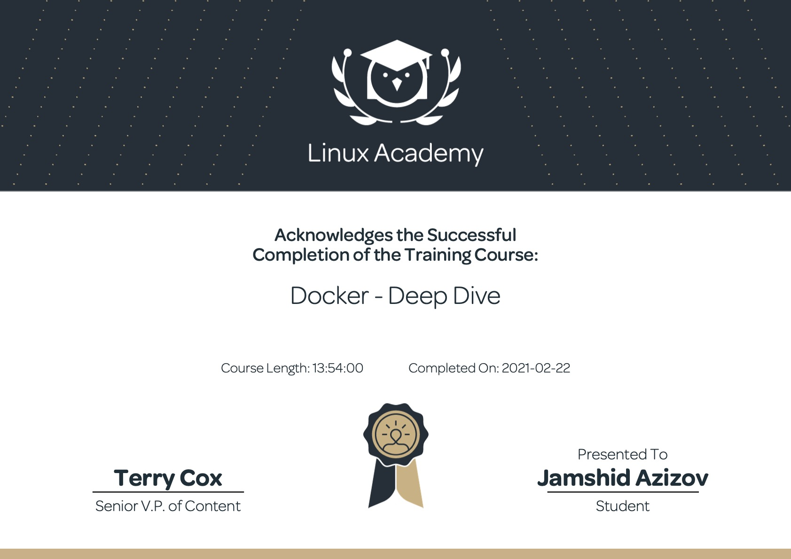
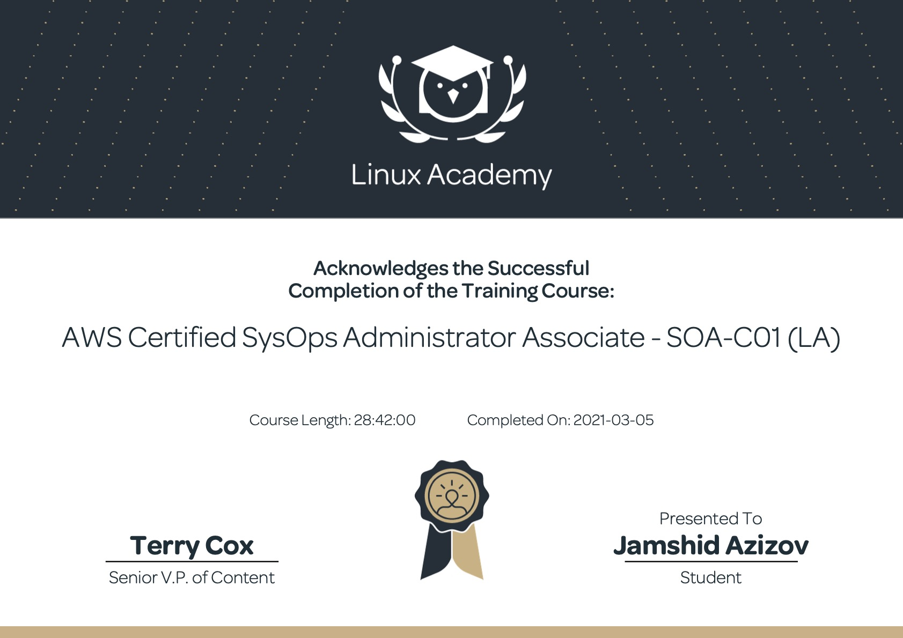
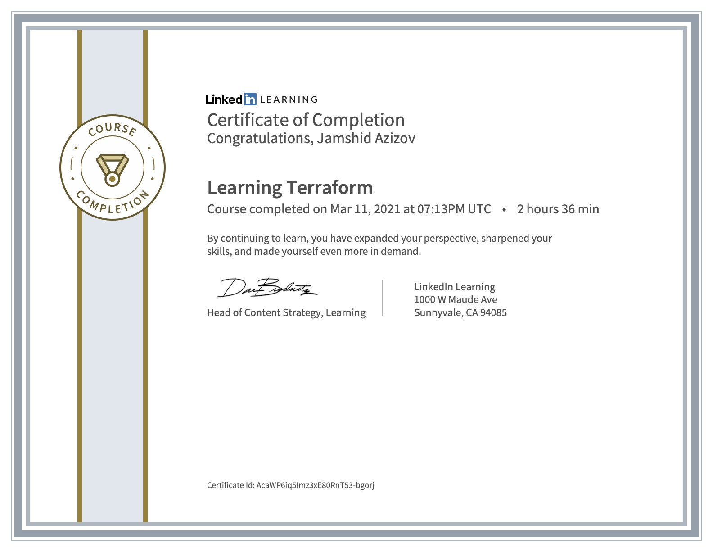
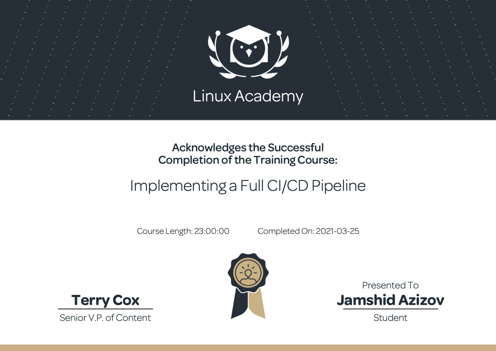

# DevOps Certificates

## Courses & Certificates

## Module 0 - Extra

### DevOps Foundations

### EngX Bootcamp

## Module 1 - Basics

### Git

### Vim

https://linuxacademy.com/profile/u/cert/id/413505

## Markup Languages _ XML, Yaml, JSON
### XML Essential Training

### Processing and Interchanging JSON Data

## Module 2 - Operating Systems

### RHCSA

https://linuxacademy.com/profile/u/cert/id/414493

## Module 3 - Scripting languages

### The System Administrator's Guide to Bash Scripting

https://linuxacademy.com/profile/u/cert/id/415199

## Module 4 - Networking

### Network Routing Fundamentals

https://linuxacademy.com/profile/u/cert/id/415428

## Module 5 - Configuration Management

### Ansible: Setup, Configure, and Ad Hoc Commands Deep Dive

https://linuxacademy.com/profile/u/cert/id/415658

### Ansible: Playbooks Deep Dive

https://linuxacademy.com/profile/u/cert/id/415829

### Learn Ansible by Doing

https://linuxacademy.com/profile/u/cert/id/416080

## Module 6 - Continuous Integration / Continuous Delivery

### Certified Jenkins Engineer

https://linuxacademy.com/profile/u/cert/id/417144

### Certified Jenkins Engineer - Test Results

## Module 7 - Containerization

## Docker

### Docker - Deep Dive

https://linuxacademy.com/profile/u/cert/id/417714

## Kubernetes

### Kubernetes Essentials

https://linuxacademy.com/profile/u/cert/id/417903

### Certified Kubernetes Administrator (CKA)

https://linuxacademy.com/profile/u/cert/id/418939

## CI/CD & K8s

### Learn Jenkins by Doing

https://linuxacademy.com/profile/u/cert/id/423667

## Module 8 - Clouds _ AWS

### AWS Certified SysOps Administrator Associate - SOA-C01 (LA)

https://linuxacademy.com/profile/u/cert/id/420029

### AWS Certified SysOps Administrator - Associate 2020

https://linuxacademy.com/profile/u/cert/id/424676

## Module 9 - Terraform

### Deploying to AWS with Terraform and Ansible

https://linuxacademy.com/profile/u/cert/id/420174

### Learning Terraform

https://www.linkedin.com/learning/learning-terraform-2/welcome?u=2113185

## CI/CD

### Implementing a Full CI/CD Pipeline

https://linuxacademy.com/profile/u/cert/id/423665

